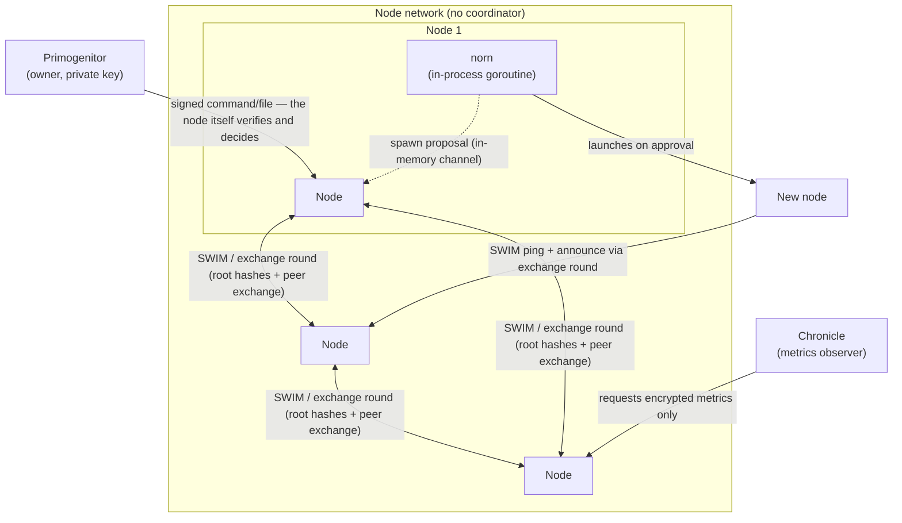

# SporeMachine


A self-replicating, coordinator-free peer-to-peer swarm, written in Go.

Nodes exchange data and commands with each other over gossip, without a central coordinator, and can spawn new nodes over time — the swarm grows on its own, within limits the owner controls. Current version: `v0.1.1`.

## Overview

The unit of data in the network is a `data` object: either a file or a bash command. Objects are immutable and content-addressed — identified by the hash of their own content, never by an externally assigned ID.

- **Node** — the core module of the network: stores and serves data objects, participates in membership and gossip, verifies and executes received commands, and collects/distributes metrics. Nodes are peers — there is no coordinator and no leader election.
- **Norn** — not a separate process, but a goroutine inside each node's own process, responsible for proposing and launching new node instances (the network's self-replication mechanism).
- **Primogenitor** — the owner's one-shot entry point into the network: launches the first node and submits signed files/commands through any reachable node afterward. It is external to the node network and does not control nodes directly.
- **Chronicle** — an independent observer process: pulls only metrics (never data) from any reachable node, decrypts them, and exposes/exports them (Prometheus/Grafana, or a growth-visualization video).
- **Genesis** — not a process, but a configuration blob (network ID, owner's public key, metrics-encryption public key, spawn rules) that Primogenitor hands to the first node, and that every subsequently spawned node inherits unchanged.

## Architecture



The arrow from Primogenitor to a node is a signed message the node itself verifies and decides whether to act on — not direct control over the node's process.

### Data and command flow

1. The owner signs a command (or prepares a file); Primogenitor submits it to the network through any reachable node.
2. The object propagates like any other data object: nodes periodically exchange the root hash of their local Merkle tree (not a list of IDs) in the same round as peer exchange; a hash mismatch triggers a batched, level-by-level Merkle walk to fetch what's missing.
3. Differences are merged as a grow-only set: missing immutable objects are simply added — there is nothing to conflict, since content is never modified after creation.
4. Any node that receives a validly signed command executes it independently — execution is not limited to one node or a designated subset; every node the command reaches runs it.
5. Node termination is a special case: a signed "terminate" message is not content-addressed and does not go through gossip — it's relayed directly to every known neighbor, each of which forwards it further before shutting itself down.

### Self-replication

Norn periodically proposes a new node to its own node; the node decides whether to agree based on the network's `Genesis` rules (a generation-depth limit, and a per-node cap on how many live children it may have spawned at once). On approval, Norn launches a new OS process, which inherits `Genesis`, gets its own identity and generation number, and becomes fully independent of its parent — it joins membership via ordinary SWIM pings and announces itself via the normal gossip round; there is no separate join procedure.

### Metrics and observability

Every node collects a small set of baseline metrics about itself (process resources, membership counts, command/exec stats, storage size, sync volume), periodically packages them into an encrypted snapshot, and distributes that snapshot through a second, independent Merkle tree using the same gossip mechanism as data. Any node can hold a copy of that tree, but only the holder of the corresponding private key (Primogenitor or Chronicle) can decrypt the snapshots inside it. Chronicle pulls that tree from any reachable node and exposes it via Prometheus/Grafana, or renders a growth/decay visualization from historical snapshots.

## Concurrency and guarantees

- Membership uses SWIM (direct + indirect ping, incarnation numbers to refute false suspicion).
- Every node independently and repeatedly gossips with a few random peers; nothing is centrally scheduled.
- A Merkle walk uses a consistent snapshot of the tree for the duration of one walk, even if the local object set changes concurrently.
- Data convergence is only guaranteed among currently reachable nodes, after a sync has actually completed, and only in the absence of new additions in the meantime — not at an arbitrary point in time.

## Security model

- Commands and files are signed with the owner's private key; that key exists only inside Primogenitor and is never transmitted over the network. Every node holds the public key and independently verifies signatures before acting.
- Threat model: capturing any single node is treated as normal, not exceptional — a captured node exposes everything physically stored on it (files, commands, metrics, membership view) except the owner's private key, which is never present on a node in the first place. Content is deliberately *not* encrypted at the node-storage level, since that wouldn't protect against this exact scenario (the attacker who captured the node can already read whatever it can read).
- Metrics are the one exception to "everything is exposed on capture": they're encrypted with a separate keypair (public half distributed to every node via `Genesis`, private half held only by Primogenitor/Chronicle), so a captured node's view of *other* nodes' metrics (learned via gossip) stays opaque. A captured node's *own* current metrics are still exposed, since it necessarily holds them in plaintext to produce them.
- Metrics objects are checked for content integrity (hash match) but are not signed the way commands/files are — there is currently no mechanism to prove which node actually produced a given metrics snapshot.

## Known limitations

This is an early-stage project; several things are explicitly unresolved rather than silently assumed:

- No transport-layer encryption between nodes yet (gRPC runs over an insecure channel).
- No proof of authorship for metrics snapshots (see security model above).
- The metrics Merkle tree grows without bound — no expiry/epoch mechanism yet.
- Command execution results aren't recorded or reported anywhere.
- No chunked storage for files too large to fit on one node.
- The exact moment a node is considered "dead" for visualization/reporting purposes isn't fully pinned down.

## Getting started

Requires Go 1.26+.

```sh
go build ./...
```

1. **Generate the owner's keys** (once per network):

   ```sh
   go run ./cmd/keygen --network-id my-network --out primogenitor-settings.yaml
   ```

2. **Start the first node** via Primogenitor:

   ```sh
   go run ./cmd/primogenitor start \
     --settings primogenitor-settings.yaml \
     --node-binary /path/to/built/node/binary \
     --port 17000
   ```

   `start` picks debug-friendly defaults for how far and how fast the swarm can grow (`--max-generation-depth`, `--max-children-per-batch`, `--batch-pause-seconds`, `--spawn-interval-seconds`) — tune these before growing a swarm on a single machine.

3. **Submit a file or a signed command** to the running network:

   ```sh
   go run ./cmd/primogenitor submit-file --settings primogenitor-settings.yaml ./some-file
   go run ./cmd/primogenitor submit-command --settings primogenitor-settings.yaml "echo hello from the swarm"
   ```

4. **Terminate the whole network:**

   ```sh
   go run ./cmd/primogenitor terminate --settings primogenitor-settings.yaml
   ```

5. **Observe metrics with Chronicle** (needs its own settings file with the node address and the metrics private key):

   ```sh
   go run ./cmd/chronicle run --settings chronicle-settings.yaml
   # or, from a previously exported CSV:
   go run ./cmd/chronicle export-csv --settings chronicle-settings.yaml --out growth.csv
   go run ./cmd/chronicle render-video --in growth.csv --out growth.gif
   ```

`cmd/node` is the node binary itself — normally launched by Primogenitor or by a parent node's `norn`, not run by hand.

## Development

```sh
make check   # gofmt, go vet, golangci-lint, build, go test -race
```

Requires [`golangci-lint`](https://golangci-lint.run/) installed locally; CI (`.github/workflows/ci.yml`) runs the same checks on every push/PR.

## License

MIT — see [LICENSE](LICENSE).
